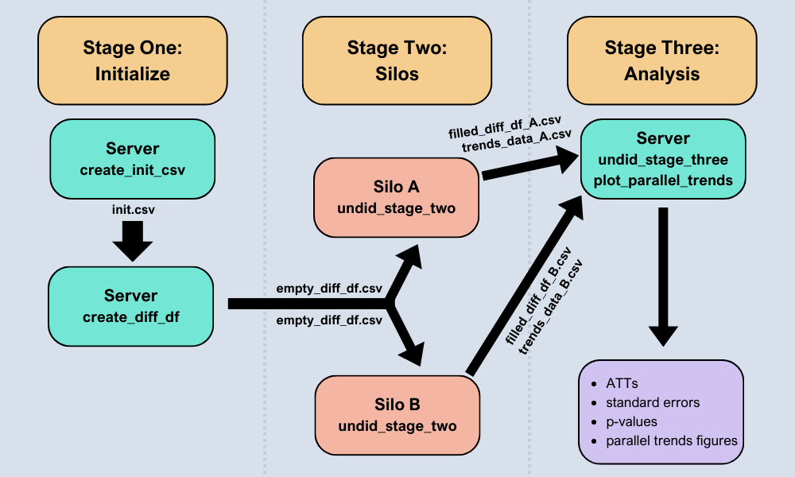

<!-- README.md is generated from README.Rmd. Please edit that file -->

# undidR

<!-- badges: start -->

[](https://github.com/ebjamieson97/undidR/actions/workflows/R-CMD-check.yaml)
[](https://app.codecov.io/gh/ebjamieson97/undidR)
<!-- badges: end -->

The **undidR** package provides the framework for implementing
difference-in-differences with unpoolable data (UNDID) developed in
[Karim, Webb, Austin, and Strumpf
(2024)](https://arxiv.org/abs/2403.15910v2). UNDID is designed to
estimate the average treatment effect on the treated (ATT) in settings
where data from different silos cannot be pooled together (potentially
for reasons of confidentiality). The package supports both common and
staggered adoption scenarios, as well as the optional inclusion of
covariates. Additionally, **undidR** incorporates a randomization
inference (RI) procedure, based on [MacKinnon and Webb
(2020)](https://doi.org/10.1016/j.jeconom.2020.04.024), for calculating
p-values for the UNDID ATT.

See the image below for an overview of the **undidR** framework:

\## Installation

You can install the development version of undidR from
<https://github.com/ebjamieson97/undidR> with:

``` r
install.packages("devtools") # If devtools is not already installed
devtools::install_github("ebjamieson97/undidR", dependencies = TRUE,
                         build_vignettes = TRUE)
```

## Examples

For a set of highly detailed examples see the package vignette using:

``` r
vignette("undidR", package = "undidR")
```

The following code chunks show some basic examples of using **undidR**
at each of its three stages.

### Stage One: `create_init_csv()` & `create_diff_df()`

``` r
library(undidR)
init <- create_init_csv(silo_names = c("73", "46", "54", "23", "86", "32",
                                       "71", "58", "64", "59", "85", "57"),
                        start_times = "1989",
                        end_times = "2000",
                        treatment_times = c(rep("control", 6),
                                            "1991", "1993", "1996", "1997",
                                            "1997", "1998"))
#> init.csv saved to: C:/Users/Eric Bruce Jamieson/AppData/Local/Temp/RtmpMDdO8j/init.csv
init
#>    silo_name start_time end_time treatment_time
#> 1         73       1989     2000        control
#> 2         46       1989     2000        control
#> 3         54       1989     2000        control
#> 4         23       1989     2000        control
#> 5         86       1989     2000        control
#> 6         32       1989     2000        control
#> 7         71       1989     2000           1991
#> 8         58       1989     2000           1993
#> 9         64       1989     2000           1996
#> 10        59       1989     2000           1997
#> 11        85       1989     2000           1997
#> 12        57       1989     2000           1998

init_filepath <- normalizePath(file.path(tempdir(), "init.csv"),
                               winslash = "/", mustWork = FALSE)
empty_diff_df <- create_diff_df(init_filepath, date_format = "yyyy",
                                freq = "yearly",
                                covariates = c("asian", "black", "male"))
#> empty_diff_df.csv saved to: C:/Users/Eric Bruce Jamieson/AppData/Local/Temp/RtmpMDdO8j/empty_diff_df.csv
head(empty_diff_df, 4)
#>   silo_name gvar treat diff_times        gt RI start_time end_time
#> 1        73 1991     0  1991;1990 1991;1991  0       1989     2000
#> 2        73 1991     0  1992;1990 1991;1992  0       1989     2000
#> 3        73 1991     0  1993;1990 1991;1993  0       1989     2000
#> 4        73 1991     0  1994;1990 1991;1994  0       1989     2000
#>   diff_estimate diff_var diff_estimate_covariates diff_var_covariates
#> 1            NA       NA                       NA                  NA
#> 2            NA       NA                       NA                  NA
#> 3            NA       NA                       NA                  NA
#> 4            NA       NA                       NA                  NA
#>         covariates date_format   freq
#> 1 asian;black;male        yyyy 1 year
#> 2 asian;black;male        yyyy 1 year
#> 3 asian;black;male        yyyy 1 year
#> 4 asian;black;male        yyyy 1 year
```

### Stage Two: `undid_stage_two()`

``` r
silo_data <- silo71
empty_diff_filepath <- system.file("extdata/staggered", "empty_diff_df.csv",
                                   package = "undidR")
stage2 <- undid_stage_two(empty_diff_filepath, silo_name = "71",
                          silo_df = silo_data, time_column = "year",
                          outcome_column = "coll", silo_date_format = "yyyy")
#> filled_diff_df_71.csv saved to: C:/Users/Eric Bruce Jamieson/AppData/Local/Temp/RtmpMDdO8j/filled_diff_df_71.csv
#> trends_data_71.csv saved to: C:/Users/Eric Bruce Jamieson/AppData/Local/Temp/RtmpMDdO8j/trends_data_71.csv
head(stage2$diff_df, 4)
#>   silo_name gvar treat diff_times        gt RI start_time   end_time
#> 1        71 1991     1  1991;1990 1991;1991  0 1989-01-01 2000-01-01
#> 2        71 1991     1  1992;1990 1991;1992  0 1989-01-01 2000-01-01
#> 3        71 1991     1  1993;1990 1991;1993  0 1989-01-01 2000-01-01
#> 4        71 1991     1  1994;1990 1991;1994  0 1989-01-01 2000-01-01
#>   diff_estimate    diff_var diff_estimate_covariates diff_var_covariates
#> 1    0.12916667 0.009447555              0.116348472         0.009397021
#> 2    0.06916667 0.008602222              0.069515594         0.008272557
#> 3    0.02546296 0.007975422              0.005133291         0.007767637
#> 4    0.02703901 0.008564103              0.029958108         0.008338060
#>         covariates date_format   freq
#> 1 asian;black;male        yyyy 1 year
#> 2 asian;black;male        yyyy 1 year
#> 3 asian;black;male        yyyy 1 year
#> 4 asian;black;male        yyyy 1 year
head(stage2$trends_data, 4)
#>   silo_name treatment_time time mean_outcome mean_outcome_residualized
#> 1        71           1991 1989    0.3061224                 0.1998800
#> 2        71           1991 1990    0.2708333                 0.1502040
#> 3        71           1991 1991    0.4000000                 0.1949109
#> 4        71           1991 1992    0.3400000                 0.1876636
#>         covariates date_format   freq
#> 1 asian;black;male        yyyy 1 year
#> 2 asian;black;male        yyyy 1 year
#> 3 asian;black;male        yyyy 1 year
#> 4 asian;black;male        yyyy 1 year
```

### Stage Three: `undid_stage_three()`

``` r
dir_path <- system.file("extdata/staggered", package = "undidR")
results <- undid_stage_three(dir_path, agg = "silo", covariates = TRUE,
                             nperm = 501)
#> Completed 100 of 500 permutations
#> Completed 200 of 500 permutations
#> Completed 300 of 500 permutations
#> Completed 400 of 500 permutations
#> Completed 500 of 500 permutations
results
#>   silo_name    silo_ATT    silo_SE  silo_p_val silo_jknife_SE silo_jknife_p_val
#> 1        57 -0.08144843 0.06215099 0.205650586     0.08649845       0.358207857
#> 2        58  0.05280529 0.02538483 0.042267963     0.02689507       0.054760168
#> 3        59  0.12365658 0.03562132 0.001823809     0.04254611       0.007377655
#> 4        64  0.07263498 0.03311326 0.035420278     0.03786681       0.063776333
#> 5        71  0.04618515 0.02595757 0.079666710     0.02796956       0.103295735
#> 6        85  0.07400401 0.03456541 0.041820821     0.04102590       0.082856564
#>      agg_ATT agg_ATT_SE agg_ATT_p_val agg_ATT_jknife_SE agg_ATT_jknife_p_val
#> 1 0.04797293 0.02570683     0.1210099        0.02816042            0.1636711
#> 2         NA         NA            NA                NA                   NA
#> 3         NA         NA            NA                NA                   NA
#> 4         NA         NA            NA                NA                   NA
#> 5         NA         NA            NA                NA                   NA
#> 6         NA         NA            NA                NA                   NA
#>   agg_ATT_RI_p_val
#> 1            0.172
#> 2               NA
#> 3               NA
#> 4               NA
#> 5               NA
#> 6               NA
```
