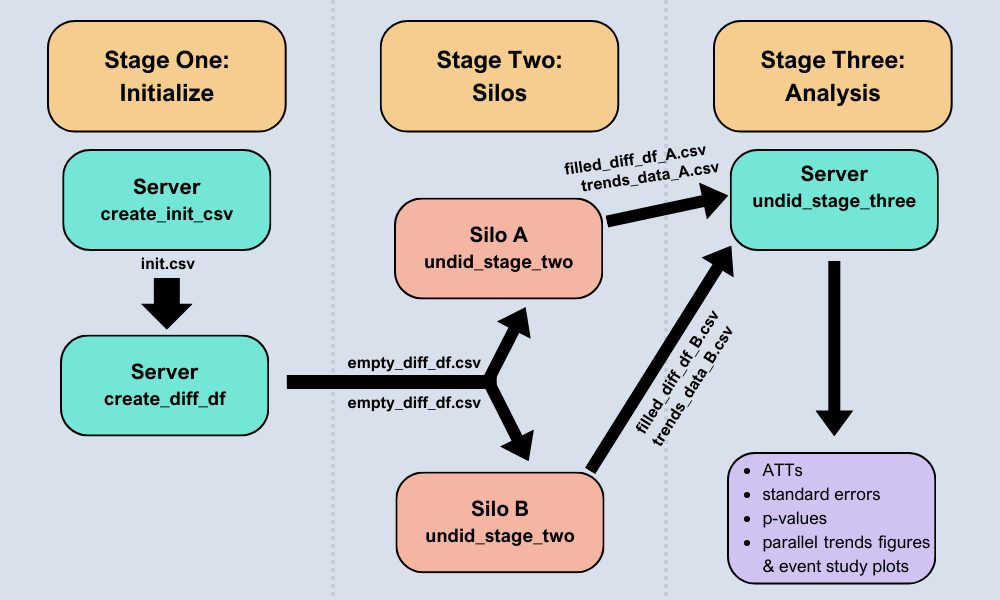
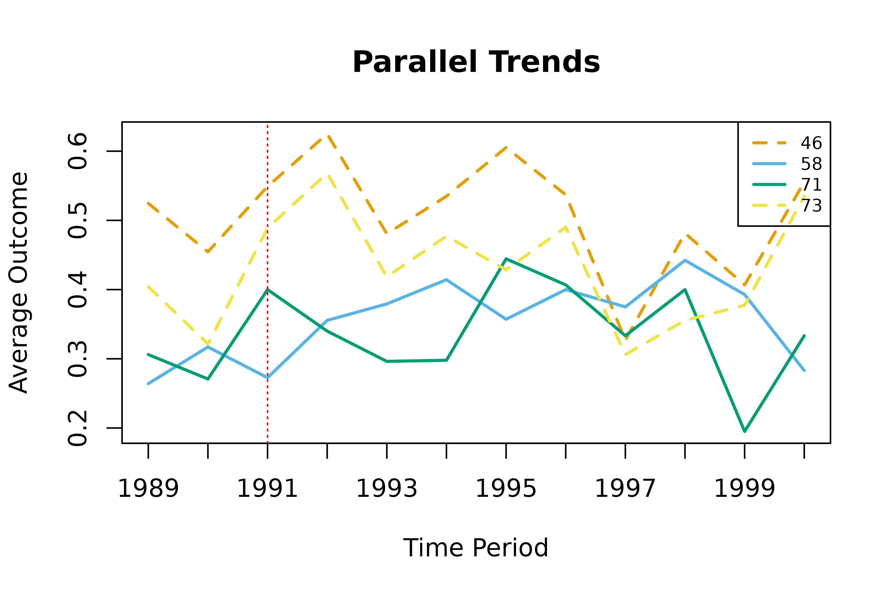
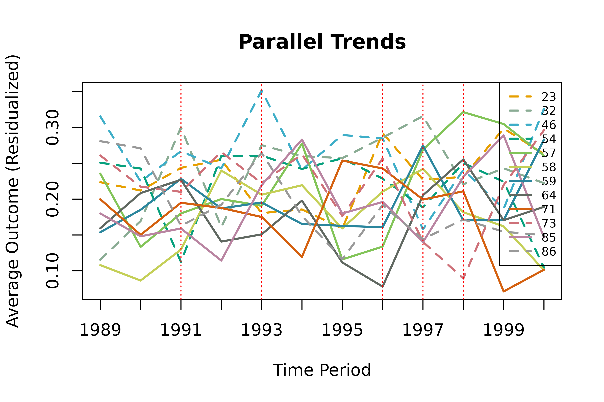
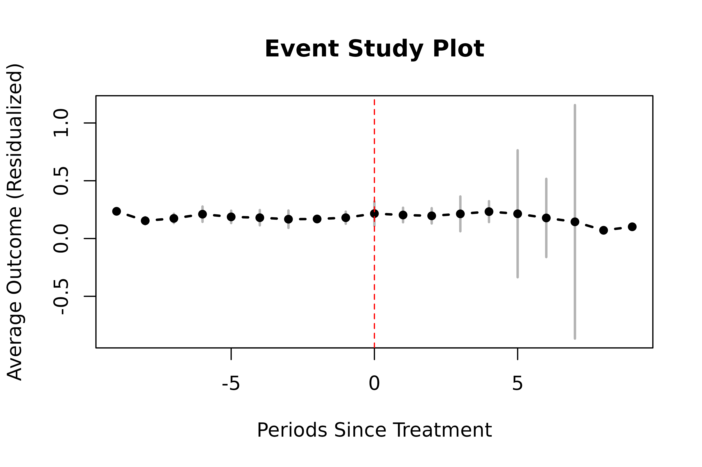

# undidR

``` r
library(undidR)
```

## Introduction

The **undidR** package implements difference-in-differences with
unpoolable data (UNDID); a framework that enables the estimation of the
average treatment effect on the treated (ATT) when the data from
different silos is not poolable. UNDID allows for staggered or common
adoption and the inclusion of covariates.

In addition, **undidR** also implements the randomization inference (RI)
procedure for difference-in-differences described in [MacKinnon and Webb
(2020)](https://doi.org/10.1016/j.jeconom.2020.04.024) to calculate RI
p-values.

Below is an overview of the **undidR** framework:



Schematic of the UNDID framework.

The following sections detail some examples of implementing **undidR**
at each of its three stages for both staggered and common adoption
scenarios.

## 1. Stage One: Initialize

When calling
[`create_init_csv()`](https://ebjamieson97.github.io/undidR/reference/create_init_csv.md)
silo names must be specified along with their corresponding treatment
times. Consequently, the `silos_names` vector must be the same length as
the `treatment_times` vector.

All dates must be entered in the same date format. To see valid date
formats within the **undidR** package call
[`undid_date_formats()`](https://ebjamieson97.github.io/undidR/reference/undid_date_formats.md).

Covariates may be specified when calling either
[`create_init_csv()`](https://ebjamieson97.github.io/undidR/reference/create_init_csv.md)
or when calling
[`create_diff_df()`](https://ebjamieson97.github.io/undidR/reference/create_diff_df.md)
via the `covariates` parameter.

The choice of weights is also set during the initialization stage. The
options of weights are one of: `"none"`, `"diff"`, `"att"`, or `"both"`.
Each of these options describes levels at which the weights are applied.
The `"diff"` option uses weights based off of the number of observations
(treated and untreated) associated with each contrast (difference) at
each silo. The weights are used when computing the subaggregate ATTs
from the differences. The counts of these observations are recorded
during stage two and kept in the `n` column of the `diff_df` CSV files.
Likewise, the number of observations after treatment time are stored in
the `n_t` column. The “`att`” weighting option uses the number of
post-treatment observations from treated silos associated with each
subaggregate ATT as weights when computing the aggregate ATT from the
subaggregate ATTs.

### 1.1 Common Treatment Time (Stage One)

``` r
# First, an initializing CSV is created detailing the silos
# and their treatment times. Control silos (here, 73 and 46)
# should be labelled with "control".
init <- create_init_csv(silo_names = c("73", "46", "71", "58"),
                        start_times = "1989",
                        end_times = "2000",
                        treatment_times = c("control", "control",
                                            "1991", "1991"))
#> init.csv saved to: /tmp/RtmpfHtMlr/init.csv
init
#>   silo_name start_time end_time treatment_time
#> 1        73       1989     2000        control
#> 2        46       1989     2000        control
#> 3        71       1989     2000           1991
#> 4        58       1989     2000           1991

# After the initializing CSV file is created, `create_diff_df()`
# can be called. This creates the empty differences data frame which
# will then be filled out at each individual silo for its respective portion.
init_filepath <- normalizePath(file.path(tempdir(), "init.csv"),
                               winslash = "/", mustWork = FALSE)
empty_diff_df <- create_diff_df(init_filepath, date_format = "yyyy",
                                freq = "yearly", weights = "both")
#> empty_diff_df.csv saved to: /tmp/RtmpfHtMlr/empty_diff_df.csv
empty_diff_df
#>   silo_name treat common_treatment_time start_time end_time weights
#> 1        73     0                  1991       1989     2000    both
#> 2        46     0                  1991       1989     2000    both
#> 3        71     1                  1991       1989     2000    both
#> 4        58     1                  1991       1989     2000    both
#>   diff_estimate diff_var diff_estimate_covariates diff_var_covariates
#> 1            NA       NA                       NA                  NA
#> 2            NA       NA                       NA                  NA
#> 3            NA       NA                       NA                  NA
#> 4            NA       NA                       NA                  NA
#>   covariates date_format   freq  n n_t anonymize_size
#> 1       none        yyyy 1 year NA  NA             NA
#> 2       none        yyyy 1 year NA  NA             NA
#> 3       none        yyyy 1 year NA  NA             NA
#> 4       none        yyyy 1 year NA  NA             NA
```

### 1.2 Staggered Adoption (Stage One)

``` r
# The initializing CSV for staggered adoption is created in the same way.
# When `create_diff_df()` is run, it will automatically detect whether or not
# the initial setup is for a common adoption or staggered adoption scenario.
init <- create_init_csv(silo_names = c("73", "46", "54", "23", "86", "32",
                                       "71", "58", "64", "59", "85", "57"),
                        start_times = "1989",
                        end_times = "2000",
                        treatment_times = c(rep("control", 6),
                                            "1991", "1993", "1996", "1997",
                                            "1997", "1998"))
#> init.csv saved to: /tmp/RtmpfHtMlr/init.csv
init
#>    silo_name start_time end_time treatment_time
#> 1         73       1989     2000        control
#> 2         46       1989     2000        control
#> 3         54       1989     2000        control
#> 4         23       1989     2000        control
#> 5         86       1989     2000        control
#> 6         32       1989     2000        control
#> 7         71       1989     2000           1991
#> 8         58       1989     2000           1993
#> 9         64       1989     2000           1996
#> 10        59       1989     2000           1997
#> 11        85       1989     2000           1997
#> 12        57       1989     2000           1998

# Creating the empty differences data frame and associated CSV file is
# the same for the case of staggered adoption as it is for common adoption.
init_filepath <- normalizePath(file.path(tempdir(), "init.csv"),
                               winslash = "/", mustWork = FALSE)
empty_diff_df <- create_diff_df(init_filepath, date_format = "yyyy",
                                freq = "yearly", weights = "both",
                                covariates = c("asian", "black", "male"))
#> empty_diff_df.csv saved to: /tmp/RtmpfHtMlr/empty_diff_df.csv
head(empty_diff_df, 4)
#>   silo_name gvar treat diff_times        gt RI start_time end_time weights
#> 1        73 1991     0  1991;1990 1991;1991  0       1989     2000    both
#> 2        73 1991     0  1992;1990 1991;1992  0       1989     2000    both
#> 3        73 1991     0  1993;1990 1991;1993  0       1989     2000    both
#> 4        73 1991     0  1994;1990 1991;1994  0       1989     2000    both
#>   diff_estimate diff_var diff_estimate_covariates diff_var_covariates
#> 1            NA       NA                       NA                  NA
#> 2            NA       NA                       NA                  NA
#> 3            NA       NA                       NA                  NA
#> 4            NA       NA                       NA                  NA
#>         covariates date_format   freq  n n_t anonymize_size
#> 1 asian;black;male        yyyy 1 year NA  NA             NA
#> 2 asian;black;male        yyyy 1 year NA  NA             NA
#> 3 asian;black;male        yyyy 1 year NA  NA             NA
#> 4 asian;black;male        yyyy 1 year NA  NA             NA
```

## 2. Stage Two: Silos

The second stage function,
[`undid_stage_two()`](https://ebjamieson97.github.io/undidR/reference/undid_stage_two.md),
creates two CSV files. The first is the filled portion of the
differences data frame for the respective silo. The second captures the
mean (and the mean residualized by the specified covariates) of the
outcome variable from the `start_time` to the `end_time` in intervals of
`freq`.

These are returned from
[`undid_stage_two()`](https://ebjamieson97.github.io/undidR/reference/undid_stage_two.md)
as a list of two data frames which can be accessed by the suffixes of
`$diff_df` and `$trends_data`, respectively.

In order to accommodate silos that might have very stringent data
sharing policies, there is an option of `anonymize_weights` (defaults to
`FALSE`) during the second stage. If selected, it will round the counts
in the `n` column (in the trends data and diff matrix) as well as the
`n_t` column to the closest value of `anonymize_size` (which defaults to
5).

The
[`undid_stage_two()`](https://ebjamieson97.github.io/undidR/reference/undid_stage_two.md)
looks for covariates based on how they are spelled in the
`empty_diff_df.csv` file. This means that silos may have to rename their
covariate columns.

### 2.1 Common Treatment Time (Stage Two)

``` r
# When calling `undid_stage_two()`, ensure that the `time_column` of
# the `silo_df` contains only character values, i.e. date strings.
silo_data <- silo71
silo_data$year <- as.character(silo_data$year)
empty_diff_filepath <- system.file("extdata/common", "empty_diff_df.csv",
                                   package = "undidR")
stage2 <- undid_stage_two(empty_diff_filepath, silo_name = "71",
                          silo_df = silo_data, time_column = "year",
                          outcome_column = "coll", silo_date_format = "yyyy")
#> filled_diff_df_71.csv saved to: /tmp/RtmpfHtMlr/filled_diff_df_71.csv
#> trends_data_71.csv saved to: /tmp/RtmpfHtMlr/trends_data_71.csv
head(stage2$diff_df, 4)
#>   silo_name treat common_treatment_time start_time end_time weights
#> 1        71     1                  1991       1989     2000    both
#>   diff_estimate    diff_var diff_estimate_covariates diff_var_covariates
#> 1    0.05879783 0.002597221               0.06696561         0.002532783
#>         covariates date_format   freq   n n_t anonymize_size
#> 1 asian;black;male        yyyy 1 year 569 472             NA
head(stage2$trends_data, 4)
#>   silo_name treatment_time time mean_outcome mean_outcome_residualized
#> 1        71           1991 1989    0.3061224                 0.1998800
#> 2        71           1991 1990    0.2708333                 0.1502040
#> 3        71           1991 1991    0.4000000                 0.1949109
#> 4        71           1991 1992    0.3400000                 0.1876636
#>         covariates date_format   freq  n
#> 1 asian;black;male        yyyy 1 year 49
#> 2 asian;black;male        yyyy 1 year 48
#> 3 asian;black;male        yyyy 1 year 45
#> 4 asian;black;male        yyyy 1 year 50
```

### 2.2 Staggered Adoption (Stage Two)

``` r
# Here we can see that calling `undid_stage_two()` for staggered adoption
# is no different than calling `undid_stage_two()` for common adoption.
silo_data <- silo71
silo_data$year <- as.character(silo_data$year)
empty_diff_filepath <- system.file("extdata/staggered", "empty_diff_df.csv",
                                    package = "undidR")
stage2 <- undid_stage_two(empty_diff_filepath, silo_name = "71",
                          silo_df = silo_data, time_column = "year",
                          outcome_column = "coll", silo_date_format = "yyyy")
#> filled_diff_df_71.csv saved to: /tmp/RtmpfHtMlr/filled_diff_df_71.csv
#> trends_data_71.csv saved to: /tmp/RtmpfHtMlr/trends_data_71.csv
head(stage2$diff_df, 4)
#>   silo_name gvar treat diff_times        gt RI start_time end_time weights
#> 1        71 1991     1  1991;1990 1991;1991  0       1989     2000    both
#> 2        71 1991     1  1992;1990 1991;1992  0       1989     2000    both
#> 3        71 1991     1  1993;1990 1991;1993  0       1989     2000    both
#> 4        71 1991     1  1994;1990 1991;1994  0       1989     2000    both
#>   diff_estimate    diff_var diff_estimate_covariates diff_var_covariates
#> 1    0.12916667 0.009447555              0.116348472         0.009397021
#> 2    0.06916667 0.008602222              0.069515594         0.008272557
#> 3    0.02546296 0.007975422              0.005133291         0.007767637
#> 4    0.02703901 0.008564103              0.029958108         0.008338060
#>         covariates date_format   freq   n n_t anonymize_size
#> 1 asian;black;male        yyyy 1 year  93  45             NA
#> 2 asian;black;male        yyyy 1 year  98  50             NA
#> 3 asian;black;male        yyyy 1 year 102  54             NA
#> 4 asian;black;male        yyyy 1 year  95  47             NA
head(stage2$trends_data, 4)
#>   silo_name treatment_time time mean_outcome mean_outcome_residualized
#> 1        71           1991 1989    0.3061224                 0.1998800
#> 2        71           1991 1990    0.2708333                 0.1502040
#> 3        71           1991 1991    0.4000000                 0.1949109
#> 4        71           1991 1992    0.3400000                 0.1876636
#>         covariates date_format   freq  n
#> 1 asian;black;male        yyyy 1 year 49
#> 2 asian;black;male        yyyy 1 year 48
#> 3 asian;black;male        yyyy 1 year 45
#> 4 asian;black;male        yyyy 1 year 50
```

## 3. Stage Three: Analysis

The third stage of **undidR** produces the aggregate ATT estimate, its
standard errors, and its p-values, as well as group level ATT estimates
for staggered adoption.

In the case of staggered adoption these group level ATTs can either be
grouped by silo (`agg = "silo"`), by treatment time (`agg = "g"`), by
treatment time for every time period after treatment has started
(`agg = "gt"`), or, the `"gt"` aggregation can further be separated by
silo with `agg = "sgt"`. There is also an option to aggregate by time
since treatment with `agg = "time"`.

[`undid_stage_three()`](https://ebjamieson97.github.io/undidR/reference/undid_stage_three.md)
returns an object with the class `UnDiDObj` which has four S3 methods:
[`summary()`](https://rdrr.io/r/base/summary.html),
[`print()`](https://rdrr.io/r/base/print.html),
[`coef()`](https://rdrr.io/r/stats/coef.html), and
[`plot()`](https://rdrr.io/r/graphics/plot.default.html).
[`summary()`](https://rdrr.io/r/base/summary.html) and
[`plot()`](https://rdrr.io/r/graphics/plot.default.html) are likely the
most useful.

With the [`plot()`](https://rdrr.io/r/graphics/plot.default.html) method
for `UnDiDObj`, you can specify the `event` parameter as `event = TRUE`
in order to produce an event study plot. You can specify the confidence
intervals on the event study plot with `ci` (defaults to 0.95) and the
window for which you want to observe the event study plot can be
restricted by setting `event_window = c(start, end)` where `start` and
`end` are numeric values describing the periods before and after
treatment time. The
[`plot()`](https://rdrr.io/r/graphics/plot.default.html) method for also
inherits standard parameters normally used in
[`plot()`](https://rdrr.io/r/graphics/plot.default.html).

Further, you can access the diff matrix itself that is used to compute
subaggregate ATTs and the aggregate ATT with `UnDiDObj$diff`. Likewise,
you can access the trends data with `UnDiDObj$trends`.

### 3.1 Common Treatment Time (Stage Three)

``` r
# `undid_stage_three()`, given a `dir_path`, will search that folder
# for all CSV files that begin with "filled_diff_df_" and stitch
# them together in order to compute the group level ATTs, aggregate ATT
# and associated standard errors and p-values.
dir_path <- system.file("extdata/common", package = "undidR")
results <- undid_stage_three(dir_path, covariates = FALSE, nperm = 399)
#> Warning in undid_stage_three(dir_path, covariates = FALSE, nperm = 399): If 'agg = none' then 'weights' can only be either 'none' or 'diff'.
#> Setting weights to 'diff'.
#> Warning in .compute_ri_pval(results, diff_df, nperm, agg, weights, max_attempts, : 'nperm' was set to 399 but only 5 exist.
#> Setting nperm =  5
#> Warning in .compute_ri_pval(results, diff_df, nperm, agg, weights,
#> max_attempts, : 'nperm' is less than 399.
summary(results)
#> 
#>   Weighting: diff
#>   Aggregation: none
#>   Not-yet-treated: FALSE
#>   Covariates: none
#>   HCCME: hc3
#>   Period Length: 1 year
#>   First Period: 1989
#>   Last Period: 2000
#>   Permutations: 5
#> 
#> Aggregate Results:
#>         ATT Std. Error   p-value RI p-value Jackknife SE Jackknife p-value
#>  0.02381393 0.05027192 0.6823859        0.6   0.04353676          0.622451
#> 
#> No sub-aggregate estimates available.
plot(results)
```



### 3.2 Staggered Adoption (Stage Three)

``` r
# When calling `undid_stage_three()` for staggered adoption it is
# important to specify the aggregation method, `agg`.
dir_path <- system.file("extdata/staggered", package = "undidR")
results <- undid_stage_three(dir_path, agg = "silo", covariates = TRUE,
                             nperm = 399)
#> Completed 100 of 399 permutations
#> Completed 200 of 399 permutations
#> Completed 300 of 399 permutations
head(results$diff, 4)
#>    silo_name gvar treat diff_times        gt RI start_time end_time weights
#> 1         23 7670     0  1991;1990 1991;1991  0       6940    10957    both
#> 31        32 7670     0  1991;1990 1991;1991  0       6940    10957    both
#> 61        46 7670     0  1991;1990 1991;1991  0       6940    10957    both
#> 91        54 7670     0  1991;1990 1991;1991  0       6940    10957    both
#>    diff_estimate    diff_var diff_estimate_covariates diff_var_covariates
#> 1     0.04995599 0.003025270               0.04003924         0.003049531
#> 31    0.15384615 0.010602526               0.10568820         0.010788858
#> 61    0.09447415 0.009362733               0.09122789         0.008956869
#> 91   -0.13125000 0.009224325              -0.12815145         0.009183679
#>          covariates date_format   freq   n n_t anonymize_size diff_times_post
#> 1  asian;black;male        yyyy 1 year 334 142             NA            7670
#> 31 asian;black;male        yyyy 1 year  92  40             NA            7670
#> 61 asian;black;male        yyyy 1 year 106  51             NA            7670
#> 91 asian;black;male        yyyy 1 year 109  45             NA            7670
#>    diff_times_pre    t           y       y_var
#> 1            7305 7670  0.04003924 0.003049531
#> 31           7305 7670  0.10568820 0.010788858
#> 61           7305 7670  0.09122789 0.008956869
#> 91           7305 7670 -0.12815145 0.009183679

head(results$trends, 4)
#>   silo_name treatment_time       time mean_outcome mean_outcome_residualized
#> 1        23        control 1989-01-01    0.3963415                 0.2236357
#> 2        23        control 1990-01-01    0.4218750                 0.2119609
#> 3        23        control 1991-01-01    0.4718310                 0.2435888
#> 4        23        control 1992-01-01    0.4625850                 0.2549387
#>         covariates date_format   freq   n time_label         y period
#> 1 asian;black;male        yyyy 1 year 164       1989 0.2236357      1
#> 2 asian;black;male        yyyy 1 year 192       1990 0.2119609      2
#> 3 asian;black;male        yyyy 1 year 142       1991 0.2435888      3
#> 4 asian;black;male        yyyy 1 year 147       1992 0.2549387      4
#>   time_since_treatment
#> 1                   NA
#> 2                   NA
#> 3                   NA
#> 4                   NA

summary(results)
#> 
#>   Weighting: both
#>   Aggregation: silo
#>   Not-yet-treated: FALSE
#>   Covariates: asian, black, male
#>   HCCME: hc3
#>   Period Length: 1 year
#>   First Period: 1989
#>   Last Period: 2000
#>   Permutations: 399
#> 
#> Aggregate Results:
#>        ATT Std. Error    p-value RI p-value Jackknife SE Jackknife p-value
#>  0.0732032 0.03338214 0.07980594 0.03007519    0.0366304        0.07099495
#> 
#> Subaggregate Results:
#> Silo                        ATT         SE    p-value   RI p-val      JK SE   JK p-val     Weight
#> -------------------------------------------------------------------------------------------------------------- 
#> 71                       0.0434     0.0275     0.1192     0.3083         NA         NA     0.2428
#> 58                       0.0478     0.0260     0.0710     0.4486         NA         NA     0.2305
#> 64                       0.0451     0.0407     0.2757     0.5965         NA         NA     0.0910
#> 59                       0.1454     0.0412     0.0016     0.0602         NA         NA     0.2922
#> 85                       0.0964     0.0401     0.0238     0.3258         NA         NA     0.0941
#> 57                      -0.0812     0.0888     0.3718     0.2757         NA         NA     0.0494

plot(results)
```



``` r
plot(results, event = TRUE)
```

 \## References

You can access citations by calling `citation("undidR")`.

``` r
citation("undidR")
#> To cite the UN-DID paper, please use:
#> 
#>   Karim S, Webb M, Austin N, Strumpf E (2024).
#>   "Difference-in-Differences with Unpoolable Data." _arXiv preprint
#>   arXiv:2403.15910_. <https://arxiv.org/abs/2403.15910>.
#> 
#> If you are using randomization inference p-values, please also cite:
#> 
#>   MacKinnon J, Webb M (2020). "Randomization inference for
#>   difference-in-differences with few treated clusters." _Journal of
#>   Econometrics_, *218*(2), 435-450.
#>   <https://doi.org/10.1016/j.jeconom.2020.04.024>.
#> 
#> To cite the undidR software package:
#> 
#>   Jamieson E (2025). "undidR: Difference-in-Differences with Unpoolable
#>   Data." R package version 3.0.0,
#>   <https://doi.org/10.32614/CRAN.package.undidR>.
#> 
#> To see these entries in BibTeX format, use 'print(<citation>,
#> bibtex=TRUE)', 'toBibtex(.)', or set
#> 'options(citation.bibtex.max=999)'.
print(citation("undidR"), bibtex = TRUE)
#> To cite the UN-DID paper, please use:
#> 
#>   Karim S, Webb M, Austin N, Strumpf E (2024).
#>   "Difference-in-Differences with Unpoolable Data." _arXiv preprint
#>   arXiv:2403.15910_. <https://arxiv.org/abs/2403.15910>.
#> 
#> A BibTeX entry for LaTeX users is
#> 
#>   @Article{,
#>     title = {Difference-in-Differences with Unpoolable Data},
#>     author = {Sunny Karim and Matthew D. Webb and Nichole Austin and Erin Strumpf},
#>     year = {2024},
#>     journal = {arXiv preprint arXiv:2403.15910},
#>     url = {https://arxiv.org/abs/2403.15910},
#>   }
#> 
#> If you are using randomization inference p-values, please also cite:
#> 
#>   MacKinnon J, Webb M (2020). "Randomization inference for
#>   difference-in-differences with few treated clusters." _Journal of
#>   Econometrics_, *218*(2), 435-450.
#>   <https://doi.org/10.1016/j.jeconom.2020.04.024>.
#> 
#> A BibTeX entry for LaTeX users is
#> 
#>   @Article{,
#>     title = {Randomization inference for difference-in-differences with few treated clusters},
#>     author = {James G. MacKinnon and Matthew D. Webb},
#>     year = {2020},
#>     journal = {Journal of Econometrics},
#>     volume = {218},
#>     number = {2},
#>     pages = {435-450},
#>     url = {https://doi.org/10.1016/j.jeconom.2020.04.024},
#>   }
#> 
#> To cite the undidR software package:
#> 
#>   Jamieson E (2025). "undidR: Difference-in-Differences with Unpoolable
#>   Data." R package version 3.0.0,
#>   <https://doi.org/10.32614/CRAN.package.undidR>.
#> 
#> A BibTeX entry for LaTeX users is
#> 
#>   @Misc{,
#>     title = {undidR: Difference-in-Differences with Unpoolable Data},
#>     author = {Eric Jamieson},
#>     year = {2025},
#>     note = {R package version 3.0.0},
#>     url = {https://doi.org/10.32614/CRAN.package.undidR},
#>   }
```

Karim, S., Webb, M., Austin, N., and Strumpf, E. 2024.
Difference-in-Differences with Unpoolable Data.
<https://arxiv.org/abs/2403.15910>

MacKinnon, J. and Webb, M. 2020. Randomization inference for
difference-in-differences with few treated clusters. Journal of
Econometrics. <https://doi.org/10.1016/j.jeconom.2020.04.024>
